# Examen de Redes II – *En Busca de la Red Perdida*
---
https://github.com/csantillgar/ExamenRedes.git
---

## Parte I: Conceptos y Teoría

---

### 1. El Mural de las Siete Capas

Te adentras en la sala principal del templo y descubres un gran mural compuesto por siete franjas horizontales superpuestas, decoradas con símbolos y jeroglíficos. Cada franja representa un nivel diferente en un ritual de comunicación. Los sabios de esta civilización entendían que un mensaje debía pasar por varias etapas desde su origen hasta su destino, refinándose o traduciendo su forma en cada nivel de la pirámide comunicativa.

**Pregunta:**  
¿Qué representa el mural de las siete capas en términos de las redes de comunicación modernas? Identifica brevemente cada capa y explica cómo se relaciona este antiguo “modelo” con el proceso de comunicación de datos actual.

> El mural de las siete capas representa el modelo OSI o Modelo de Interconexión de Sistemas Abiertos. Ambas tienen siete capas y además en ambos modelos cada franja representa un nivel diferente en un ritual de comunicación. También sabemos que en el modelo antiguo el mensaje debía pasar por varias capas, en el modelo OSI actual deberá recorrer las siete capas las cuales constan de las siguientes:
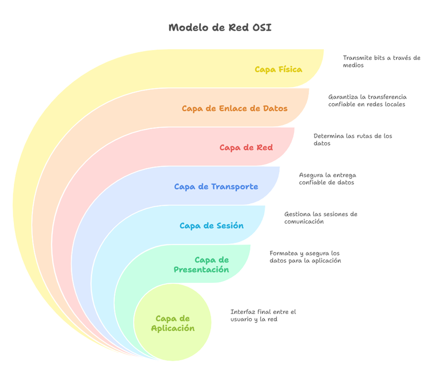
---

### 2. Los Dos Pergaminos del Mensajero

En una cámara oculta encuentras dos pergaminos polvorientos. El primero describe el Ritual del Mensajero Confiable: antes de entregar un mensaje, el mensajero realiza un saludo de tres pasos con el receptor para asegurarse de que ambos estén listos, luego entrega el mensaje y espera una confirmación de recibido. Si la confirmación no llega, reintenta el envío. El segundo pergamino narra el Ritual del Mensajero Veloz: un mensajero que sale disparado a entregar mensajes sucesivos sin aviso previo ni asegurarse de la recepción, cubriendo la mayor distancia en el menor tiempo, aunque a veces los mensajes se pierdan en el camino.

**Pregunta:**  
Interpreta los dos rituales descritos. ¿A qué protocolos de comunicación actuales equivalen el mensajero confiable y el mensajero veloz? Compara sus características, explicando las ventajas y desventajas de cada enfoque en redes modernas.

> El mensajero confiable corresponde con el protocolo **TCP** mientras que el mensajero veloz corresponde al protocolo **UDP**.

> Por un lado, el protocolo **TCP** o (*Transmission Control Protocol*), que como bien describe el enunciado en referencia al mensajero confiable, este protocolo realiza ese saludo de tres pasos que hace referencia al *Three-Way Handshake*. En este proceso se establece una conexión segura asegurándose de que el receptor del paquete puede recibirlo de forma correcta antes de transmitir los datos. Además, la espera de la confirmación y el reenvío en caso de encontrar algún error son otras de sus características principales.

>- Entre las ventajas de este protocolo, podemos distinguir que al utilizarlo los datos siempre llegarán completos y ordenados, además del correcto uso de mecanismos de control de flujo y de congestión para poder mejorar la comunicación.
>- Pero este protocolo también cuenta con ciertos inconvenientes como son la latencia que tendrá el envío de los datos debido a los múltiples pasos que realiza en el envío, además de un mayor consumo.

> Por otro lado, el protocolo **UDP** o (*User Datagram Protocol*) se caracteriza por el envío de paquetes a gran velocidad, pero sin establecer una conexión previa y sin verificar si llegaron los paquetes de forma adecuada.

>- Las ventajas más notorias de este protocolo son su velocidad y eficiencia en cuanto a su rendimiento.
>- Aunque también cuenta con desventajas como que no se garantiza una entrega completa y ordenada y puede haber pérdidas de los datos.


---

### 3. El Enigma de las Subredes

Avanzando por un pasillo, encuentras una losa de piedra con inscripciones que parecen ser direcciones numéricas. Una inscripción cuenta:  
*"Nuestro reino digital tenía la dirección sagrada 192.168.50.0. Los cuatro grandes gremios de la ciudad exigían su propio distrito en la red, todos de igual tamaño".*  
Junto a esto, ves un diagrama borroso de algo que parecen ser subredes emanando de la dirección principal, cada una con su propio identificador.

**Pregunta:**  
Descifra el enigma de la losa. Si la antigua red usaba la dirección 192.168.50.0 como base y necesitaba dividirse en 4 subredes de igual tamaño (una para cada gremio), ¿qué máscara de subred habrían utilizado los antiguos para lograrlo? ¿Cuántas direcciones de host (utilizables) tendría cada subred resultante? Explica brevemente tu razonamiento al calcular la máscara.

> Primero, debemos identificar la clase de la dirección, en este caso la dirección 192.168.50.0 pertenece a la clase **C**. Esto nos indica que de forma predeterminada tendría la máscara 255.255.255.0 (/24), esta máscara proporciona 256 direcciones a las cuales se le restan dos direcciones que se reservan para la dirección de red y la de broadcast. Por esa razón contamos realmente con **254 direcciones útiles**.

> Segundo, ahora determinamos la cantidad de bits que vamos a necesitar para las cuatro subredes. En la red de clase C con máscara /24 tendremos 8 bits para los hosts. Para poder contar con cuatro subredes será necesario restarle **dos bits adicionales** de la parte del host. Por lo tanto, para la máscara de subred vamos a contar con **26 bits** en vez de 24 y en la parte de host contaremos con **6 bits** en vez de 8. La máscara pasará a ser la **/26 o 255.255.255.192**.

> Tercero, pasaremos ahora a calcular cuánto host tiene cada subred y cuántos de ellos serán utilizables. Como ya he dicho anteriormente sabemos que cada subred cuenta con 6 bits para los hosts correspondientes, por lo tanto, contaremos con 2⁶ = **64 direcciones por subred**. Pero solo serán **utilizables 62**, ya que la primera será para la dirección de red, y la última será para la dirección de broadcast.

---

#### Esta tabla representa el rango de las direcciones por cada subred:

| Subred | Dirección de Red     | Primer Host         | Último Host         | Dirección de Broadcast |
|--------|-----------------------|----------------------|----------------------|--------------------------|
| 1      | 192.168.50.0/26       | 192.168.50.1         | 192.168.50.62        | 192.168.50.63            |
| 2      | 192.168.50.64/26      | 192.168.50.65        | 192.168.50.126       | 192.168.50.127           |
| 3      | 192.168.50.128/26     | 192.168.50.129       | 192.168.50.190       | 192.168.50.191           |
| 4      | 192.168.50.192/26     | 192.168.50.193       | 192.168.50.254       | 192.168.50.255           |

---
### 4. La Encrucijada de las Rutas

Llegas a una encrucijada dentro de las ruinas: cuatro caminos diferentes se extienden hacia distintas aldeas en los alrededores de la ciudad antigua. En el centro, un tótem tallado muestra flechas apuntando hacia cada camino, con inscripciones de destinos y distancias. Notas que algunas flechas parecen fijas e inmutables (talladas en la piedra), mientras que otras son piezas móviles que pudieron reorientarse si se abría o cerraba algún camino en el pasado. Este tótem se asemeja a un antiguo dispositivo de enrutamiento que dirigía el tráfico de datos por el camino adecuado.

> **Pregunta:**  
> ¿Qué concepto moderno de redes representa el tótem con flechas de la encrucijada? Explica qué es una tabla de enrutamiento y cómo funciona en un router actual. Además, interpreta la diferencia entre las flechas talladas en piedra y las flechas móviles en términos de enrutamiento estático vs. enrutamiento dinámico en redes.

**Respuesta:**

El tótem representa el concepto moderno de **tabla de enrutamiento**, el cual es un componente fundamental en los routers actuales.

Una tabla de enrutamiento es un conjunto de normas que se almacena en el router y que tiene como función principal escoger el camino que tomarán los paquetes para llegar de forma óptima a su destino. Esta tabla funciona como un mapa. Cada entrada en la tabla suele incluir:

- Una red de destino (donde se dirige).
- Una máscara de subred (rango de direcciones dentro de la red de destino).
- Su próximo salto (dirección del router al que se debe enviar para seguir su camino).
- Una interfaz de salida (la interfaz del router que será utilizada para enviar el paquete).
- Una métrica (valor que indica la calidad de la ruta).

Las **flechas talladas en piedra** representan el **enrutamiento estático**, caracterizado por caminos fijos que se configuran manualmente y no pueden cambiar automáticamente, aunque el camino deje de estar disponible. Es más apropiado en redes pequeñas o cuando se requiere un control más preciso.

Las **flechas móviles** representan el **enrutamiento dinámico**, caracterizado por rutas ajustables que pueden modificarse según el estado de la red. Si una conexión falla y el camino se cierra, el sistema puede calcular una nueva ruta automáticamente. Este sistema utiliza protocolos de enrutamiento como **OSPF**, **BGP** o **RIP**, que son capaces de intercambiar información entre routers para actualizar las tablas de enrutamiento.

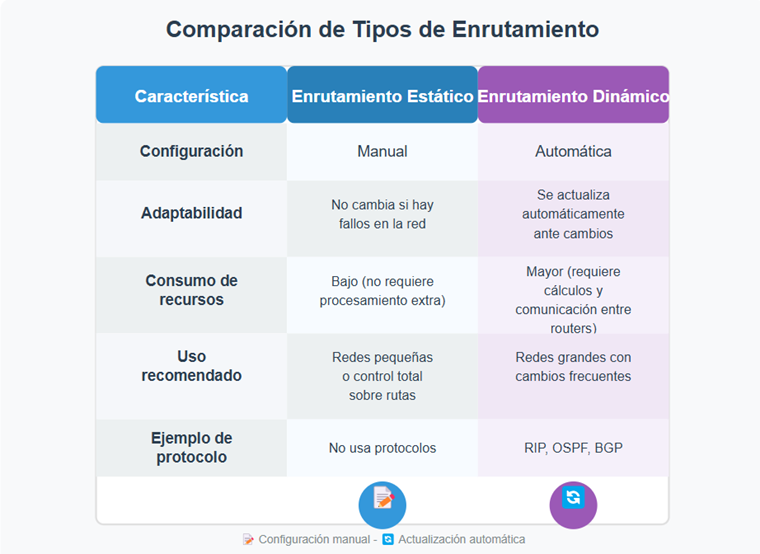
---

### 5. El Guardián de la Máscara Única

En la última sala del templo, frente a la salida, te encuentras con la estatua de un guardián con dos caras. Según una leyenda grabada en la base, este guardián protegía la ciudad oculta de los forasteros. Cuando un mensajero salía de la ciudad, el guardián reemplazaba su máscara por la suya propia, de modo que, para el mundo exterior, todos los mensajes parecían venir únicamente del guardián. Al regresar la respuesta, el guardián recordaba qué máscara original correspondía a cada mensaje y reenviaba la respuesta al habitante correcto dentro de la ciudad. Gracias a este ardid, la ciudad pudo ocultar la identidad de sus miembros y usar un único rostro para todas sus comunicaciones externas.

> **Pregunta:**  
> ¿Qué técnica de redes moderna se refleja en la leyenda del Guardián de la Máscara? Nombra y describe brevemente este mecanismo, explicando cómo permite que múltiples dispositivos internos de una red compartan una única identidad (dirección) al comunicarse con el exterior, y menciona dos beneficios que brinda esta estrategia a las redes actuales.

**Respuesta:**

La leyenda del Guardián con dos caras se asemeja a la técnica moderna conocida como **NAT (Network Address Translation)**. Este es un mecanismo que permite que varios dispositivos dentro de una red privada utilicen la **misma dirección IP pública** para comunicarse con el exterior.


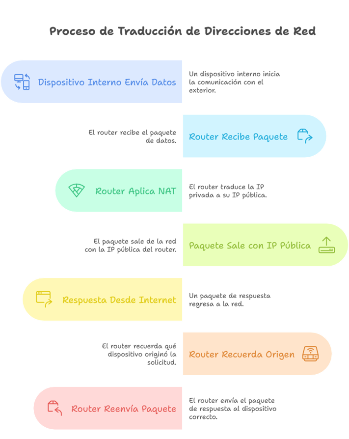

**Beneficios de NAT:**

- **Reducción del uso de direcciones IPv4:** Se utiliza solo una IP pública para múltiples dispositivos.
- **Mayor seguridad:** Oculta las IPs internas, dificultando el acceso directo desde el exterior.

---

> _Profesor, tómese un respiro. Ha guiado a su alumnado a través de los enigmas teóricos de esta antigua civilización. Ahora, prepárese para la siguiente fase: reconstruir las redes que alguna vez hicieron vibrar esta metrópolis tecnológica. ¡Ánimo, que aún queda camino por recorrer! 😆_
---

## Parte II: Práctica con Cisco Packet Tracer  
### Ejercicio 1: La Ruta Perdida entre Dos Reinos

Tras salir del templo, el diario del aventurero te conduce a los restos de dos ciudades hermanas separadas por un vasto desierto. Según los relatos, en la antigüedad estas ciudades (reinos) estaban conectadas por la Ruta Sagrada de Datos, un enlace de comunicación que permitía compartir conocimiento y recursos. Con el tiempo, la ruta cayó en el olvido y las ciudades quedaron incomunicadas, como islas aisladas. Tu misión es reconstruir esa ruta perdida para volver a unir las redes de ambas ciudades.

En términos actuales, cada ciudad tiene su propia red local (subred) y disponía de un router en su gran torre de comunicaciones. Entre ambas torres existía un enlace directo (un cable histórico que unía las dos ciudades). También se encontraban switches en las plazas centrales de cada ciudad, conectando los ordenadores (PCs) de los habitantes. Para restaurar la conexión, tendrás que configurar apropiadamente los dispositivos de ambas urbes y el enlace entre ellas.

### Objetivos / Tareas:

- **Topología**: En Packet Tracer, crea la topología con dos routers (uno para Ciudad A y otro para Ciudad B), cada uno conectado a un switch local. Conecta al menos uno o dos PCs al switch de cada ciudad (representando los habitantes que quieren comunicarse). Finalmente, establece un enlace directo entre los dos routers (puede ser un cable serial o cable cruzado, simulando la ruta desértica).

- **Direccionamiento IP**: Asigna esquemas de direcciones IP a cada red local diferentes entre sí. Por ejemplo, puedes usar la red 192.168.10.0/24 para la Ciudad A y 192.168.20.0/24 para la Ciudad B. Configura las interfaces de los PCs y de los routers con direcciones dentro de sus respectivas subredes. Para el enlace entre routers, utiliza una subred distinta (preferiblemente pequeña, p.ej. una subred /30) para conectar las interfaces serial/Ethernet entre los routers (por ejemplo, 192.168.30.0/30 para el enlace punto a punto).

- **Configuración de routing**: Puesto que cada router inicialmente solo conoce su propia red local, deberás configurar rutas estáticas para que aprendan a alcanzar la red de la otra ciudad. En cada router, añade una ruta estática que apunte a la red de la ciudad remota a través de la interfaz del enlace (por ejemplo, en el router de Ciudad A, una ruta hacia 192.168.20.0/24 vía la IP del router de Ciudad B en el enlace, y viceversa). Nota: Si lo prefieres, puedes utilizar rutas por defecto en cada router apuntando al enlace, dado que cada router solo tiene una salida para alcanzar la otra red.

- **Pruebas de conectividad**: Una vez configurado todo, verifica la comunicación haciendo ping desde un PC de la Ciudad A a un PC de la Ciudad B. Si la configuración es correcta, los paquetes atravesarán la Ruta Sagrada de Datos (el enlace restaurado) y obtendrás respuestas exitosas. Asegúrate de probar pings en ambos sentidos (A -> B y B -> A) para confirmar la ruta en ambos sentidos.

### Documentación:

Guarda el archivo Packet Tracer resultante (por ejemplo, `CiudadA-CiudadB.pkt`). En tu documentación, incluye un diagrama o descripción de la topología y un resumen de la configuración (direcciones IP usadas y rutas estáticas configuradas), para que quede claro cómo reconstruiste la conexión entre los reinos.

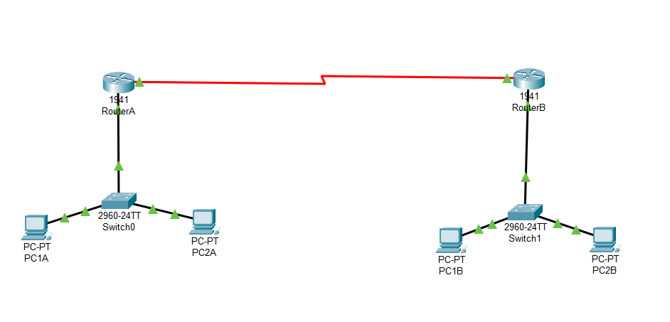
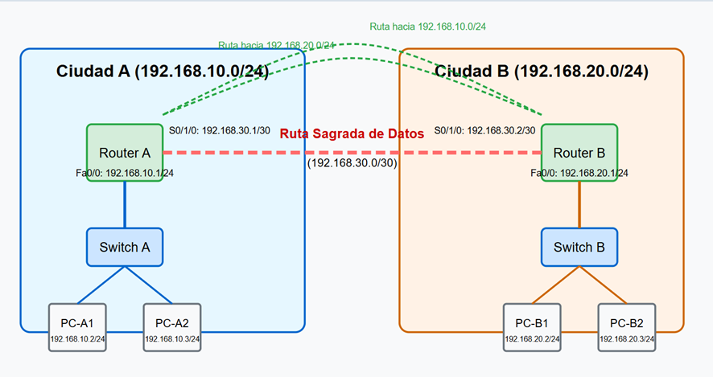
## Configuración de la conexión entre CiudadA y CiudadB

Para reconstruir la conexión entre CiudadA y CiudadB (los “reinos”), he realizado la siguiente configuración:

### Direcciones IP:

#### CiudadA:
- **PC0**: `192.168.1.2 /24` — Gateway: `192.168.1.1`  
- **PC1**: `192.168.1.3 /24` — Gateway: `192.168.1.1`  
- **Router R1**:  
  - **FastEthernet 0/0**: `192.168.1.1 /24`  
  - **Serial 0/0/0**: `10.0.0.1 /30`  

#### CiudadB:
- **PC2**: `192.168.2.2 /24` — Gateway: `192.168.2.1`  
- **PC3**: `192.168.2.3 /24` — Gateway: `192.168.2.1`  
- **Router R2**:  
  - **FastEthernet 0/0**: `192.168.2.1 /24`  
  - **Serial 0/0/0**: `10.0.0.2 /30`  

### Rutas Estáticas:

- **En Router R1 (CiudadA):**
  ```bash
  ip route 192.168.2.0 255.255.255.0 10.0.0.2
- **En Router R2 (CiudadB):**
  ```bash
  ip route 192.168.2.0 255.255.255.0 10.0.0.2
Esta configuración hace que los dispositivos de ambas ciudades se comuniquen a través de sus routers, utilizando una ruta estática por la red serial entre ambos.
### Pruebas de conectividad 
Ping desde PC ciudad A hasta PC ciudad B

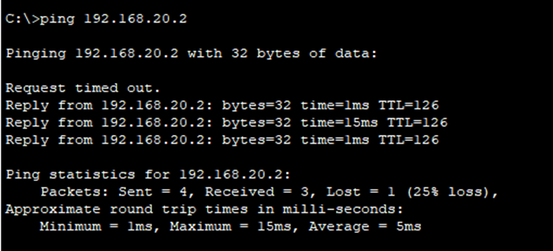

Ping desde PC ciudad B hasta PC ciudad A
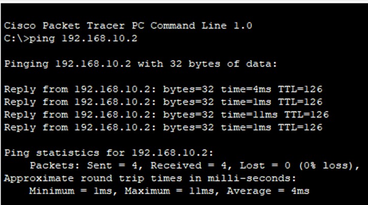
 
### Ejercicio 2: La Ciudad de las Redes Aisladas

Tras conectar las dos ciudades, te internas en las ruinas de la gran metrópolis central. Descubres que esta ciudad antigua estaba dividida en facciones o gremios, cada uno operando en su propio “canal sagrado” de comunicaciones para evitar interferencias con los otros. A pesar de compartir la misma infraestructura física (todas las guildas estaban en la misma ciudad y conectadas por los mismos caminos), utilizaron alguna forma de segmentación para que sus mensajes viajaran aislados, como si existieran redes paralelas invisibles dentro de la misma urbe. Solo en la Gran Torre Central (el edificio del consejo, equivalente a un router moderno) se unían estas comunicaciones, permitiendo el intercambio de mensajes entre gremios cuando era necesario, bajo supervisión.

En términos de redes modernas, lo que has descubierto es una ciudad implementada con VLANs (Redes Locales Virtuales) para separar el tráfico de cada gremio, y un enrutamiento tipo router-on-a-stick (router con subinterfaces) en la torre central para interconectarlas de forma controlada. ¡Tu tarea es revivir esta arquitectura de red segmentada!

### Objetivos / Tareas:

- **Topología VLAN**: En Packet Tracer, recrea la ciudad con un switch central que represente la infraestructura común. Define al menos dos VLANs en el switch (una por cada gremio o grupo aislado). Por ejemplo, puedes crear VLAN 10 (Gremio de los Arquitectos) y VLAN 20 (Gremio de los Escribas). Asigna puertos del switch: conecta uno o más PCs en puertos asignados a VLAN 10, y conecta otro(s) PC(s) en puertos asignados a VLAN 20. Así, cada grupo de PCs en la misma VLAN solo podrá comunicarse entre sí directamente.

- **Router central (router-on-a-stick)**: Coloca un router que actuará como la Gran Torre Central. Conecta el router al switch mediante un único enlace troncal (un cable desde una interfaz del router a un puerto del switch configurado en modo trunk). En el router, configura subinterfaces lógicas en esa interfaz física, una subinterfaz por cada VLAN (por ejemplo, Fa0/0.10 para VLAN 10 y Fa0/0.20 para VLAN 20). Asigna a cada subinterfaz una dirección IP que servirá de puerta de enlace para la VLAN correspondiente (por ejemplo, 192.168.10.1/24 para VLAN 10 y 192.168.20.1/24 para VLAN 20).

- **Direccionamiento IP en PCs**: Configura las direcciones IP de los PCs de forma acorde a su VLAN (subred). Por ejemplo, los PCs del Gremio de Arquitectos (VLAN 10) pueden usar direcciones en la red 192.168.10.0/24 (con puerta de enlace 192.168.10.1), y los PCs del Gremio de Escribas (VLAN 20) usarán la red 192.168.20.0/24 (con puerta de enlace 192.168.20.1). Asegúrate de que no haya solapamiento entre las subredes de cada VLAN.

- **Configuración del switch**: Configura el switch para que los puertos donde conectaste los PCs pertenezcan a la VLAN adecuada (acceso untagged en su VLAN). Configura el puerto del switch que conecta al router en modo troncal (trunk), permitiendo el tráfico de ambas VLANs a través de él hacia el router. Verifica que el trunk esté etiquetando correctamente las tramas VLAN hacia el router.

- **Enrutamiento Inter-VLAN**: Una vez el router tenga sus subinterfaces configuradas y los PCs tengan como gateway la IP del router, este actuará como intermediario entre VLANs. Realiza pruebas de conectividad: por ejemplo, intenta hacer ping desde un PC de la VLAN 10 a otro PC de la VLAN 20. Si todo está bien, estos paquetes llegarán al router por el enlace troncal, el router los reenviará a la otra subred y la comunicación será posible entre gremios (VLANs) anteriormente aislados. A su vez, PCs de la misma VLAN deben poder pinguearse directamente (eso confirmará la configuración básica de VLAN).

### Documentación:

Guarda el archivo Packet Tracer de esta topología (por ejemplo, `CiudadSegmentada.pkt`). En la documentación o README de tu repositorio, incluye una descripción de cómo configuraste las VLAN en el switch, cómo configuraste el router (subinterfaces y rutas, si fueran necesarias), las direcciones IP usadas y evidencia de pruebas (puedes mencionar resultados de ping entre VLANs). Es decir, narra cómo lograste que los canales secretos de la ciudad volvieran a unirse correctamente bajo el control del router central.

## Configuración del Switch
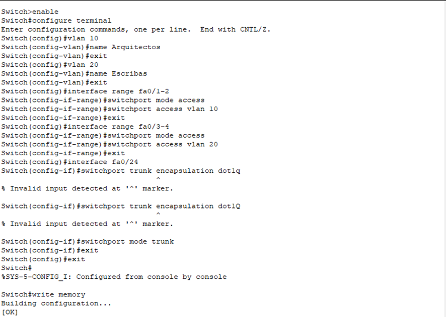

## Configuración del Router
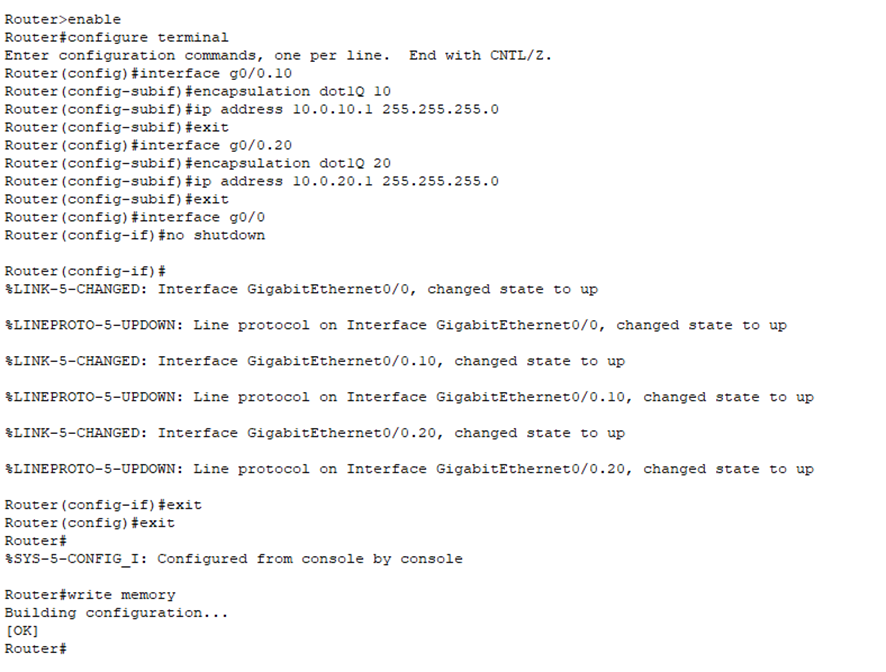

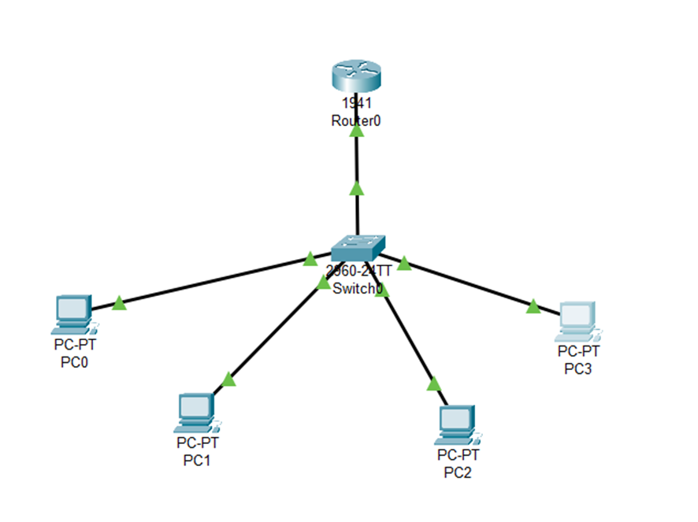

## Pruebas de Conectividad
Ping de PC1 a PC2 y PC3

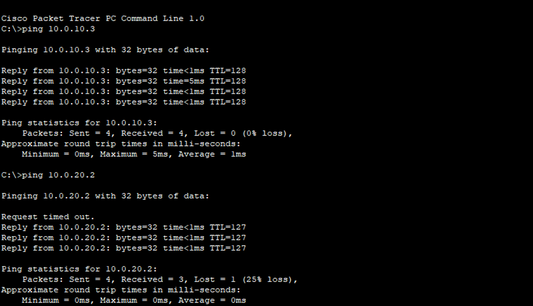
